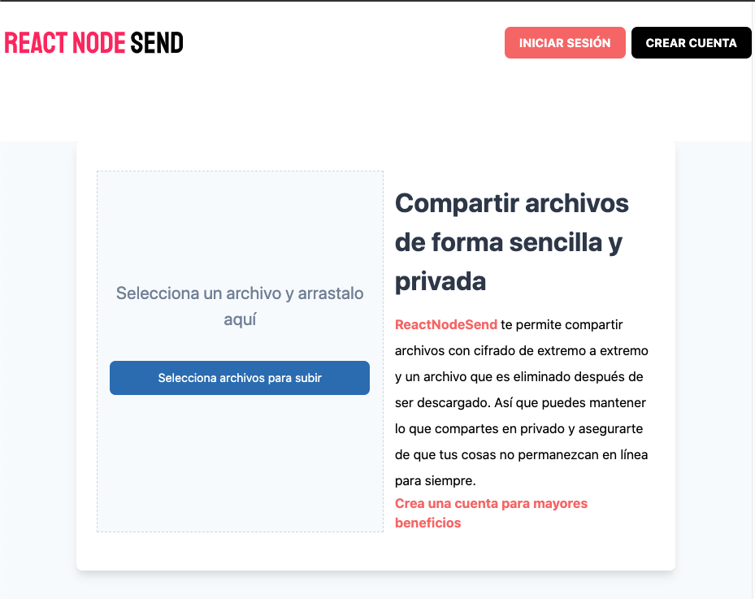

# 💻 ReactNodeSend (frontend)

ReactNodeSend te permite compartir tus archivos de forma facíl y sencilla. Sube un archivo y obtendrás un enlace para compartir y que alguien más lo descargue. Crea una cuenta para obtener beneficios como crear contraseñas, mayor limite de peso en tus archivos y establecer más de una descarga.



## 🛠 Scripts

```bash
# Instalar dependencias
$ npm install

# Encender servidor de desarrollo en localhost:3000
$ npm run dev

# Crear version de producción
$ npm run build && npm run export

```

## 💎 Tecnologías

- NextJS
- React Hooks
- TailwindCSS
- Axios
- Dropzone
